---
## Front matter
lang: ru-RU
title: Лабораторная работа № 1
subtitle: Установка и конфигурация операционной системы на виртуальную машину
author:
  - Югай А.В.
institute:
  - Российский университет дружбы народов, Москва, Россия

## i18n babel
babel-lang: russian
babel-otherlangs: english

## Fonts
mainfont: PT Serif
romanfont: PT Serif
sansfont: PT Sans
monofont: PT Mono
mainfontoptions: Ligatures=TeX
romanfontoptions: Ligatures=TeX
sansfontoptions: Ligatures=TeX,Scale=MatchLowercase
monofontoptions: Scale=MatchLowercase,Scale=0.9

## Formatting pdf
toc: false
toc-title: Содержание
slide_level: 2
aspectratio: 169
section-titles: true
theme: metropolis
header-includes:
 - \metroset{progressbar=frametitle,sectionpage=progressbar,numbering=fraction}
 - '\makeatletter'
 - '\beamer@ignorenonframefalse'
 - '\makeatother'
---

# Информация

## Докладчик

:::::::::::::: {.columns align=center}
::: {.column width="70%"}

  * Югай Александр Витальевич
  * НПИбд-02-23
  * Российский университет дружбы народов
  * [1132230302@pfur.ru]

:::
::: {.column width="30%"}

:::
::::::::::::::

## Цель работы

Приобретение практических навыков установки операционной системы на виртуальную машину, настройки минимально необходимых для дальнейшей работы сервисов.

# Выполнение лабораторной работы

## Создаем новую виртуальную машину в virtualbox

Создаем новую виртуальную машину в virtualbox

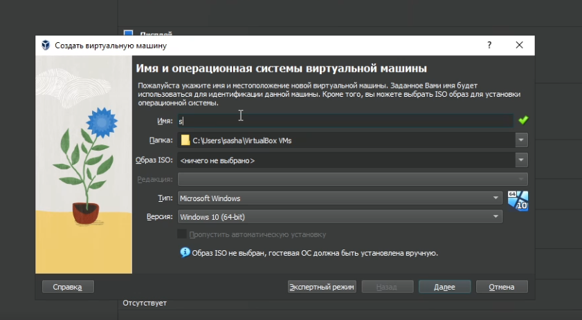

## Выделяем нужное количество оперативной памяти и ядер процессора

Выделяем нужное количество оперативной памяти и ядер процессора

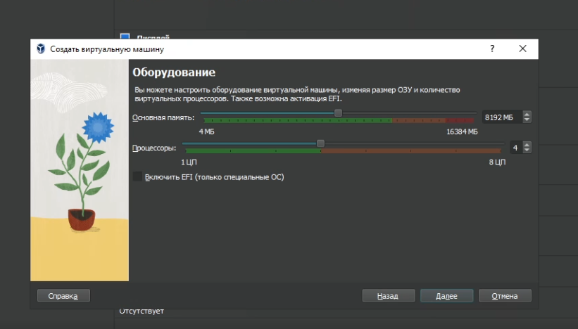

## Выделяем нужное количество памяти для виртуального диска

Выделяем нужное количество памяти для виртуального диска

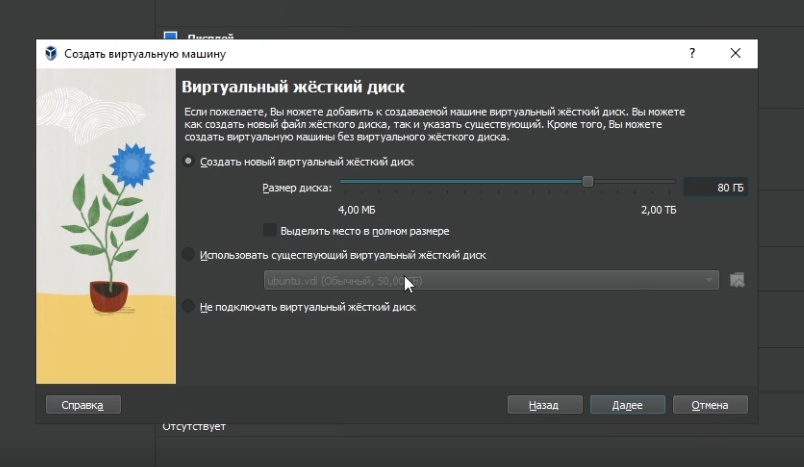

## Запускаем операционную систему

Запускаем операционную систему

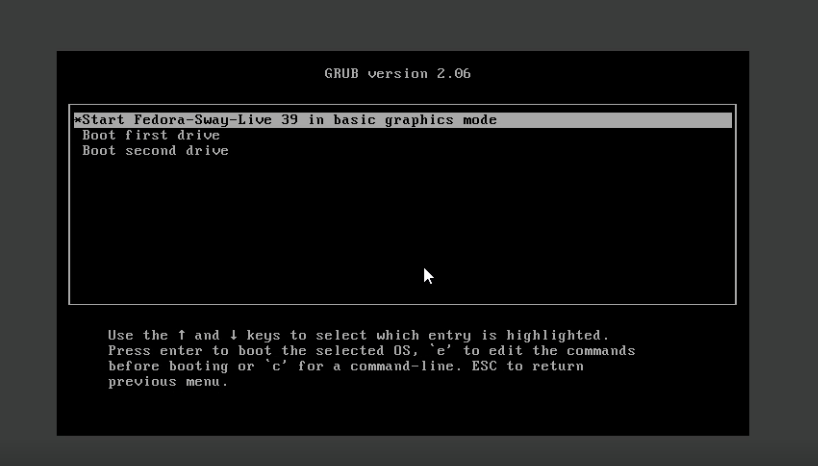

## Заходим в программу установки Anaconda

Заходим в программу установки Anaconda

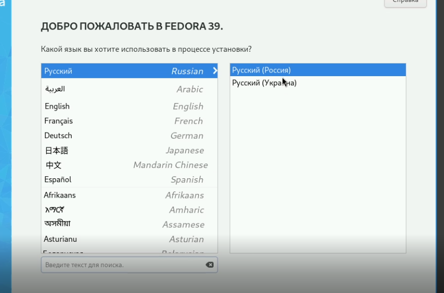

## Выбираем диск в котором будет установлена ос

Выбираем диск в котором будет установлена ос

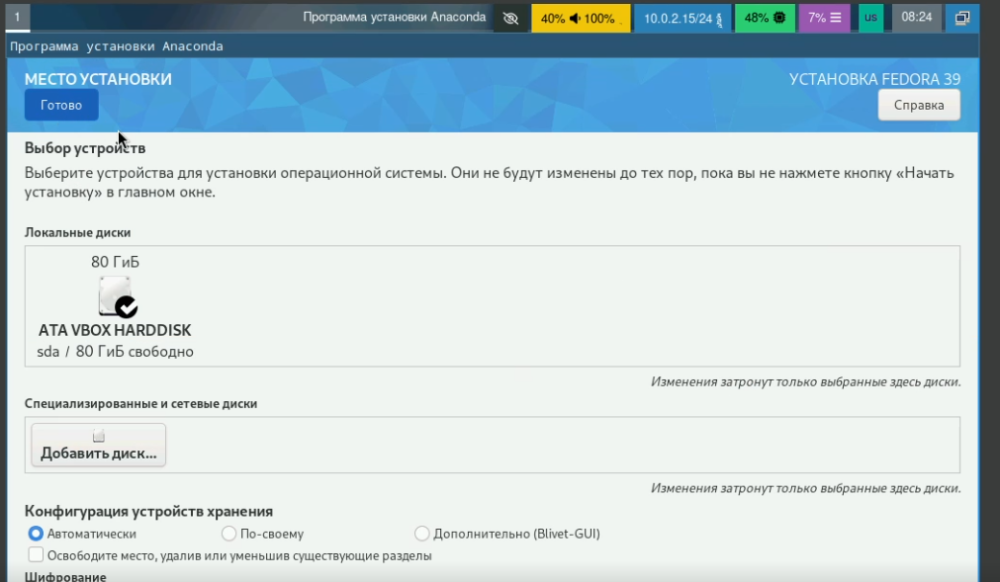

## Создаем суперпользователя

Создаем суперпользователя

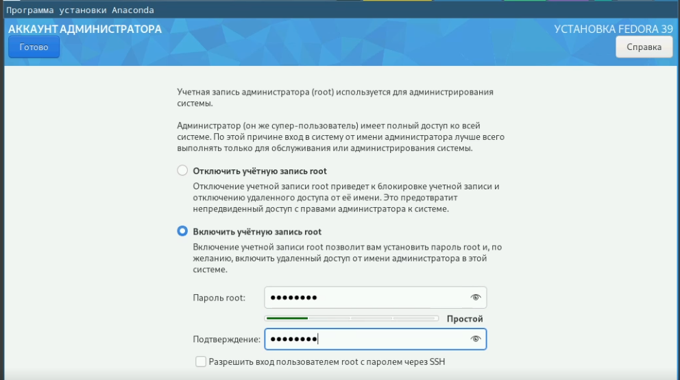

## Создаем учетную запись

Создаем учетную запись

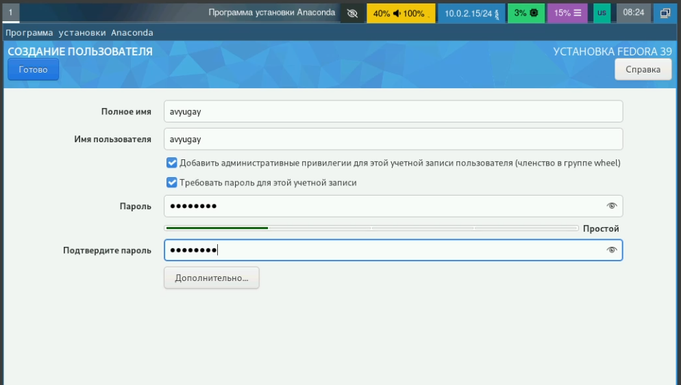

## Ждем завершения установки

Ждем завершения установки

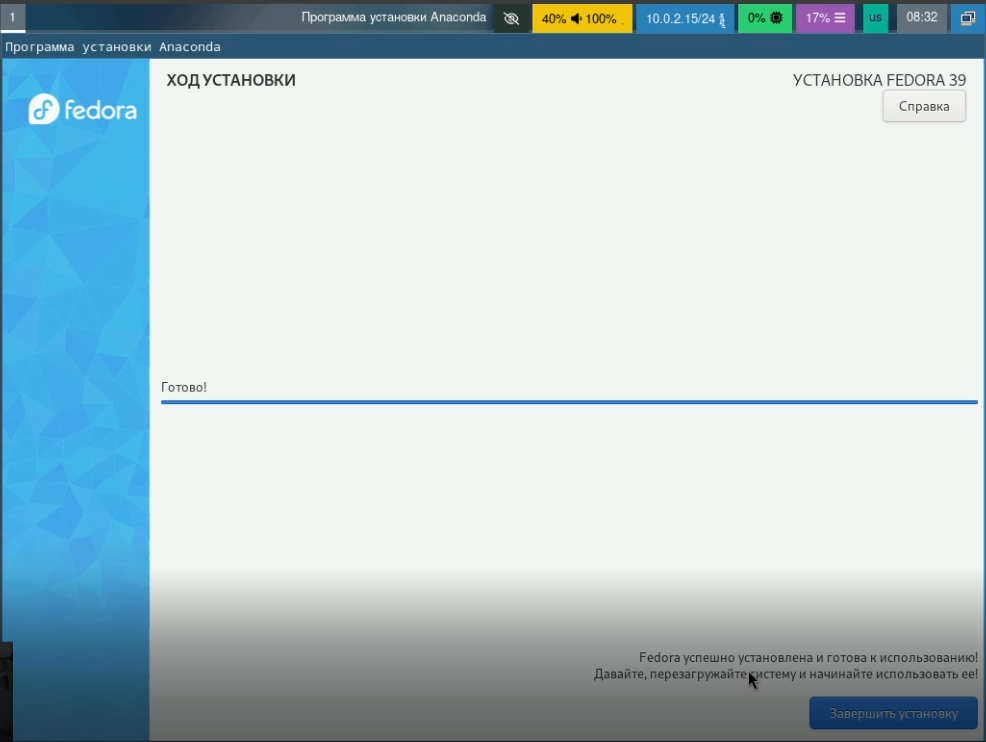

## Вынимаем загрузочный диск

Вынимаем загрузочный диск

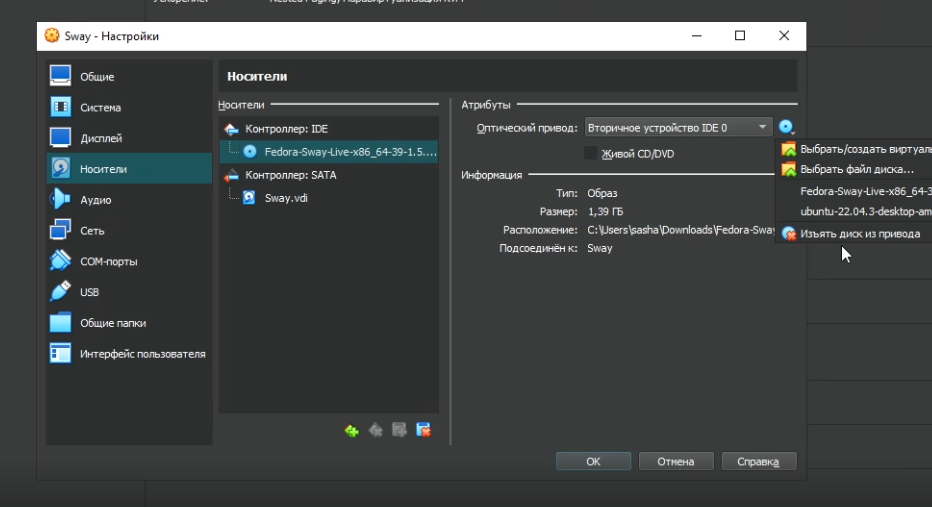

## Запускаем терминал

Запускаем терминал

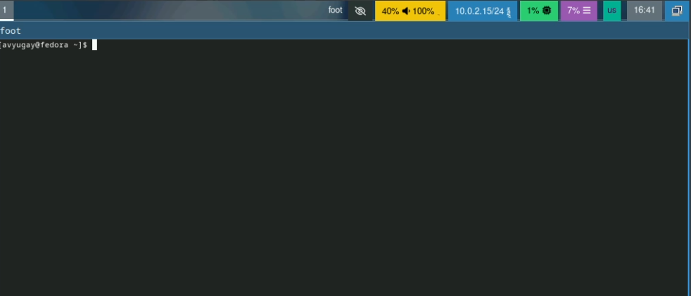

## Переключаемся на роль супер-пользователя

Переключаемся на роль супер-пользователя

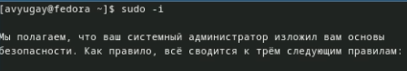

## Обновляем все пакеты

Обновляем все пакеты

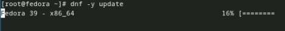

## Устанавливаем программы для удобства работы в консоли

Устанавливаем программы для удобства работы в консоли

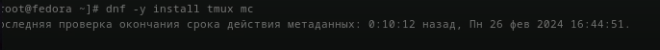

## Устанавливаем программное обеспечение для автоматического обновления

Устанавливаем программное обеспечение для автоматического обновления

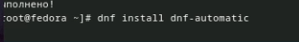

## Запускаем таймер

Запускаем таймер

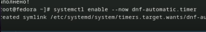

## Делаем изменения в файле config через nano

Делаем изменения в файле config через nano

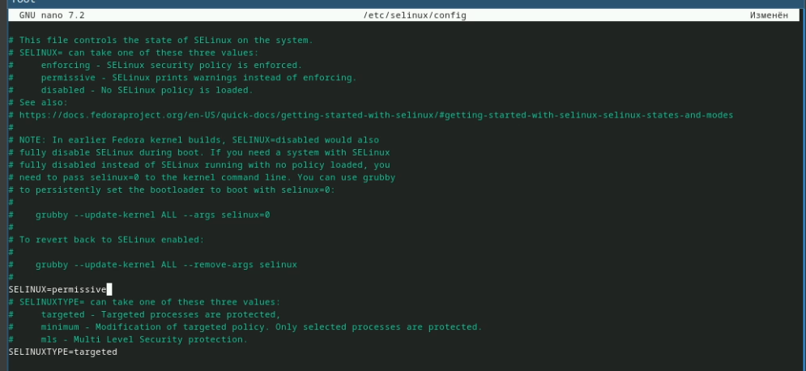

## Перезапускаем машину

Перезапускаем машину

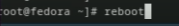

## Запускаем терминальный мультиплексор

Запускаем терминальный мультиплексор

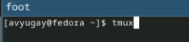

## Переключаемся на супер-пользователя

Переключаемся на супер-пользователя

## Устанавливаем средства разработки

Устанавливаем средства разработки

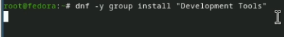

## Устанавливаем пакет DKMS

Устанавливаем пакет DKMS

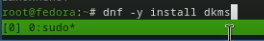

## Подключаем образ диска дополнений гостевой ОС

Подключаем образ диска дополнений гостевой ОС

## Подмонтируем диск

Подмонтируем диск

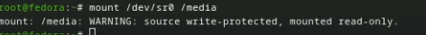

## Устанавливаем драйвера

Устанавливаем драйвера

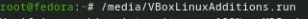

## Перезапускаем машину

Перезапускаем машину

## Запускаем терминальный мультиплексор

Запускаем терминальный мультиплексор

## Создаем конфигурационный файл и редактируем его

Создаем конфигурационный файл и редактируем его

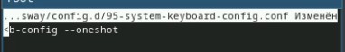

## Переключаемся на супер-пользователя

Переключаемся на супер-пользователя

## Редактируем конфигурационный файл

Редактируем конфигурационный файл

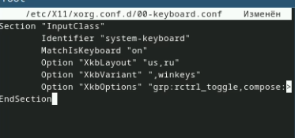

## Перезапускаем машину

Перезапускаем машину

## Запускаем терминальный мультиплексор

Запускаем терминальный мультиплексор

## Переключаемся на супер-пользователя

Переключаемся на супер-пользователя

## Устанавливаем имя хоста

Устанавливаем имя хоста

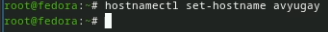

## Добавляем пользователя в группу vboxsf

Добавляем пользователя в группу vboxsf

## Перезапускаем машину

Перезапускаем машину

## Запускаем терминальный мультиплексор

Запускаем терминальный мультиплексор

## Переключаемся на супер-пользователя

Переключаемся на супер-пользователя

## Устанавливаем pandoc

Устанавливаем pandoc

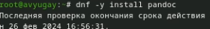

## Разархивируем pandoc и помещаем в каталог /usr/local/bin.

Разархивируем pandoc и помещаем в каталог /usr/local/bin.

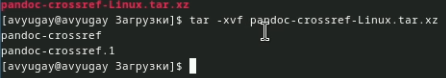

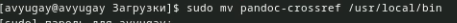

## Устанавливаем texlive

Устанавливаем texlive

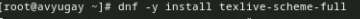

## Домашнее задание

Выполнение домашнего задания

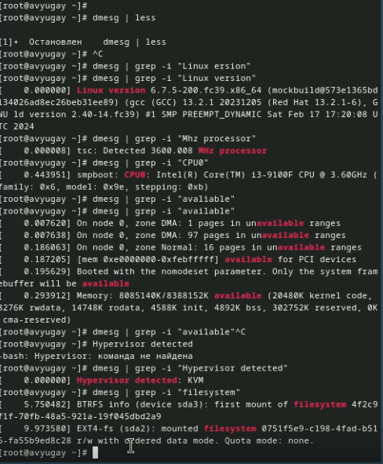

## Выводы

Я приобрел практические навыки установки операционной системы на виртуальную машину

