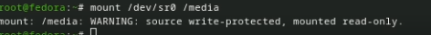

---
## Front matter
title: "Лабораторная работа № 1"
subtitle: "Установка и конфигурация операционной системы на виртуальную машину"
author: "Югай Александр Витальевич"

## Generic otions
lang: ru-RU
toc-title: "Содержание"

## Bibliography
bibliography: bib/cite.bib
csl: pandoc/csl/gost-r-7-0-5-2008-numeric.csl

## Pdf output format
toc: true # Table of contents
toc-depth: 2
lof: true # List of figures
lot: true # List of tables
fontsize: 12pt
linestretch: 1.5
papersize: a4
documentclass: scrreprt
## I18n polyglossia
polyglossia-lang:
  name: russian
  options:
	- spelling=modern
	- babelshorthands=true
polyglossia-otherlangs:
  name: english
## I18n babel
babel-lang: russian
babel-otherlangs: english
## Fonts
mainfont: PT Serif
romanfont: PT Serif
sansfont: PT Sans
monofont: PT Mono
mainfontoptions: Ligatures=TeX
romanfontoptions: Ligatures=TeX
sansfontoptions: Ligatures=TeX,Scale=MatchLowercase
monofontoptions: Scale=MatchLowercase,Scale=0.9
## Biblatex
biblatex: true
biblio-style: "gost-numeric"
biblatexoptions:
  - parentracker=true
  - backend=biber
  - hyperref=auto
  - language=auto
  - autolang=other*
  - citestyle=gost-numeric
## Pandoc-crossref LaTeX customization
figureTitle: "Рис."
tableTitle: "Таблица"
listingTitle: "Листинг"
lofTitle: "Список иллюстраций"
lotTitle: "Список таблиц"
lolTitle: "Листинги"
## Misc options
indent: true
header-includes:
  - \usepackage{indentfirst}
  - \usepackage{float} # keep figures where there are in the text
  - \floatplacement{figure}{H} # keep figures where there are in the text
---

# Цель работы

Приобретение практических навыков установки операционной системы на виртуальную машину, настройки минимально необходимых для дальнейшей работы сервисов.

# Выполнение лабораторной работы

Создаем новую виртуальную машину в virtualbox

Выделяем нужное количество оперативной памяти и ядер процессора

Выделяем нужное количество памяти для виртуального диска

Запускаем операционную систему

Заходим в программу установки Anaconda

Выбираем диск в котором будет установлена ос

Создаем суперпользователя

Создаем учетную запись

Ждем завершения установки

Вынимаем загрузочный диск

Запускаем терминал

Переключаемся на роль супер-пользователя

Обновляем все пакеты

Устанавливаем программы для удобства работы в консоли

Устанавливаем программное обеспечение для автоматического обновления

Запускаем таймер

Делаем изменения в файле config через nano

Перезапускаем машину

Запускаем терминальный мультиплексор

Переключаемся на супер-пользователя

Устанавливаем средства разработки

Устанавливаем пакет DKMS

Подключаем образ диска дополнений гостевой ОС

Подмонтируем диск

Устанавливаем драйвера

Перезапускаем машину

Запускаем терминальный мультиплексор

Создаем конфигурационный файл и редактируем его

Переключаемся на супер-пользователя

Редактируем конфигурационный файл

Перезапускаем машину

Запускаем терминальный мультиплексор

Переключаемся на супер-пользователя

Устанавливаем имя хоста

Добавляем пользователя в группу vboxsf

Перезапускаем машину

Запускаем терминальный мультиплексор

Переключаемся на супер-пользователя

Устанавливаем pandoc

Разархивируем pandoc и помещаем в каталог /usr/local/bin.

Устанавливаем texlive

# Домашнее задание

Выполнение домашнего задания

# Выводы

Я приобрел практические навыки установки операционной системы на виртуальную машину

