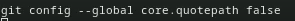
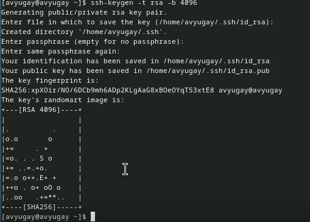
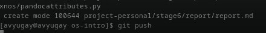

---
## Front matter
title: "Отчёт по лабораторной работе"
subtitle: "Первоначальна настройка git"
author: "Югай Александр Витальевич"

## Generic otions
lang: ru-RU
toc-title: "Содержание"

## Bibliography
bibliography: bib/cite.bib
csl: pandoc/csl/gost-r-7-0-5-2008-numeric.csl

## Pdf output format
toc: true # Table of contents
toc-depth: 2
lof: true # List of figures
lot: true # List of tables
fontsize: 12pt
linestretch: 1.5
papersize: a4
documentclass: scrreprt
## I18n polyglossia
polyglossia-lang:
  name: russian
  options:
	- spelling=modern
	- babelshorthands=true
polyglossia-otherlangs:
  name: english
## I18n babel
babel-lang: russian
babel-otherlangs: english
## Fonts
mainfont: PT Serif
romanfont: PT Serif
sansfont: PT Sans
monofont: PT Mono
mainfontoptions: Ligatures=TeX
romanfontoptions: Ligatures=TeX
sansfontoptions: Ligatures=TeX,Scale=MatchLowercase
monofontoptions: Scale=MatchLowercase,Scale=0.9
## Biblatex
biblatex: true
biblio-style: "gost-numeric"
biblatexoptions:
  - parentracker=true
  - backend=biber
  - hyperref=auto
  - language=auto
  - autolang=other*
  - citestyle=gost-numeric
## Pandoc-crossref LaTeX customization
figureTitle: "Рис."
tableTitle: "Таблица"
listingTitle: "Листинг"
lofTitle: "Список иллюстраций"
lotTitle: "Список таблиц"
lolTitle: "Листинги"
## Misc options
indent: true
header-includes:
  - \usepackage{indentfirst}
  - \usepackage{float} # keep figures where there are in the text
  - \floatplacement{figure}{H} # keep figures where there are in the text
---

# Цель работы

Изучить идеологию и применение средств контроля версий.
Освоить умения по работе с git.

# Выполнение лабораторной работы

Для начала устанавливаем пакеты git 

Начинаем настройку git

Задаем имя и email владельца репозитория

Настраиваем utf-8

Задаем имя для начальной ветки, параметр autocrlf и safecrlf

Создаем ключи ssh по алгоритмам rsa и ed25519

Генерируем ключ pgp

Выводим список созданных нами ключей и копируем отпечаток приватного ключа

Копируем pgp ключ в буфер обмена

Вставляем ключ в настройках GitHub

Используя введёный email, указываем Git применять его при подписи коммитов

Авторизовываемся через gh

Создаем репозиторий по шаблону

Настраиваем каталог курса, удаляем и создаем необходимые файлы и каталоги

Отправляем файлы на сервер

# Выводы

Я изучил идеологию и применение средств контроля версий и освоил умения по работе с git.

