---
## Front matter
lang: ru-RU
title: Лабораторная работа №2
subtitle: Первоначальна настройка git
author:
  - Югай.А.В.
institute:
  - Российский университет дружбы народов, Москва, Россия

## i18n babel
babel-lang: russian
babel-otherlangs: english

## Fonts
mainfont: PT Serif
romanfont: PT Serif
sansfont: PT Sans
monofont: PT Mono
mainfontoptions: Ligatures=TeX
romanfontoptions: Ligatures=TeX
sansfontoptions: Ligatures=TeX,Scale=MatchLowercase
monofontoptions: Scale=MatchLowercase,Scale=0.9

## Formatting pdf
toc: false
toc-title: Содержание
slide_level: 2
aspectratio: 169
section-titles: true
theme: metropolis
header-includes:
 - \metroset{progressbar=frametitle,sectionpage=progressbar,numbering=fraction}
 - '\makeatletter'
 - '\beamer@ignorenonframefalse'
 - '\makeatother'
---

# Информация

## Докладчик

:::::::::::::: {.columns align=center}
::: {.column width="70%"}

  * Югай Александр Витальевич
  * Студент
  * Российский университет дружбы народов
  * [1132230302@pfur.ru]

:::
::: {.column width="30%"}

:::
::::::::::::::

## Цель работы

Изучить идеологию и применение средств контроля версий.
Освоить умения по работе с git.

# Выполнение лабораторной работы

## Для начала устанавливаем пакеты git 

Для начала устанавливаем пакеты git 

## Начинаем настройку git

Задаем имя и email владельца репозитория

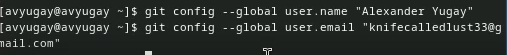

## Настраиваем utf-8

Настраиваем utf-8

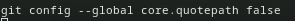

## Задаем имя для начальной ветки, параметр autocrlf и safecrlf

Задаем имя для начальной ветки, параметр autocrlf и safecrlf

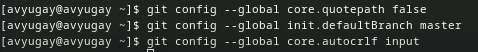

## Создаем ключи ssh по алгоритмам rsa и ed25519

Создаем ключи ssh по алгоритмам rsa и ed25519

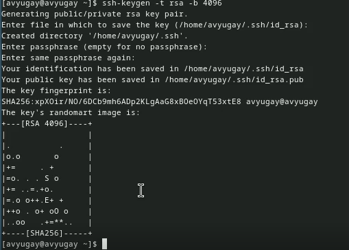

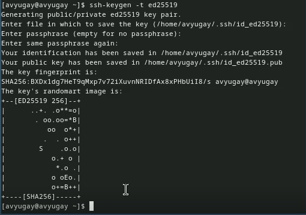

## Генерируем ключ pgp

Генерируем ключ pgp

## Выводим список созданных нами ключей и копируем отпечаток приватного ключа

Выводим список созданных нами ключей и копируем отпечаток приватного ключа

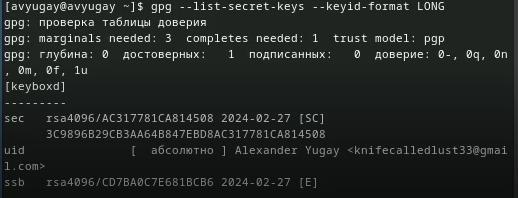

## Копируем pgp ключ в буфер обмена

Копируем pgp ключ в буфер обмена

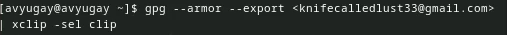

## Вставляем ключ в настройках GitHub

Вставляем ключ в настройках GitHub

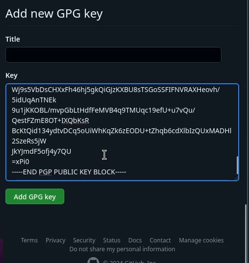

## Используя введёный email, указываем Git применять его при подписи коммитов

Используя введёный email, указываем Git применять его при подписи коммитов

## Авторизовываемся через gh

Авторизовываемся через gh

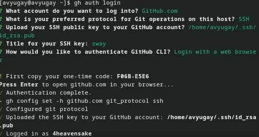

## Создаем репозиторий по шаблону

Создаем репозиторий по шаблону

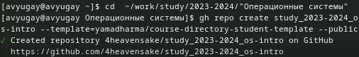

## Настраиваем каталог курса, удаляем и создаем необходимые файлы и каталоги

Настраиваем каталог курса, удаляем и создаем необходимые файлы и каталоги

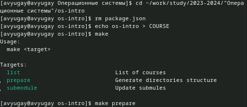

## Отправляем файлы на сервер

Отправляем файлы на сервер

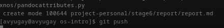

## Выводы

Я изучил идеологию и применение средств контроля версий и освоил умения по работе с git.
